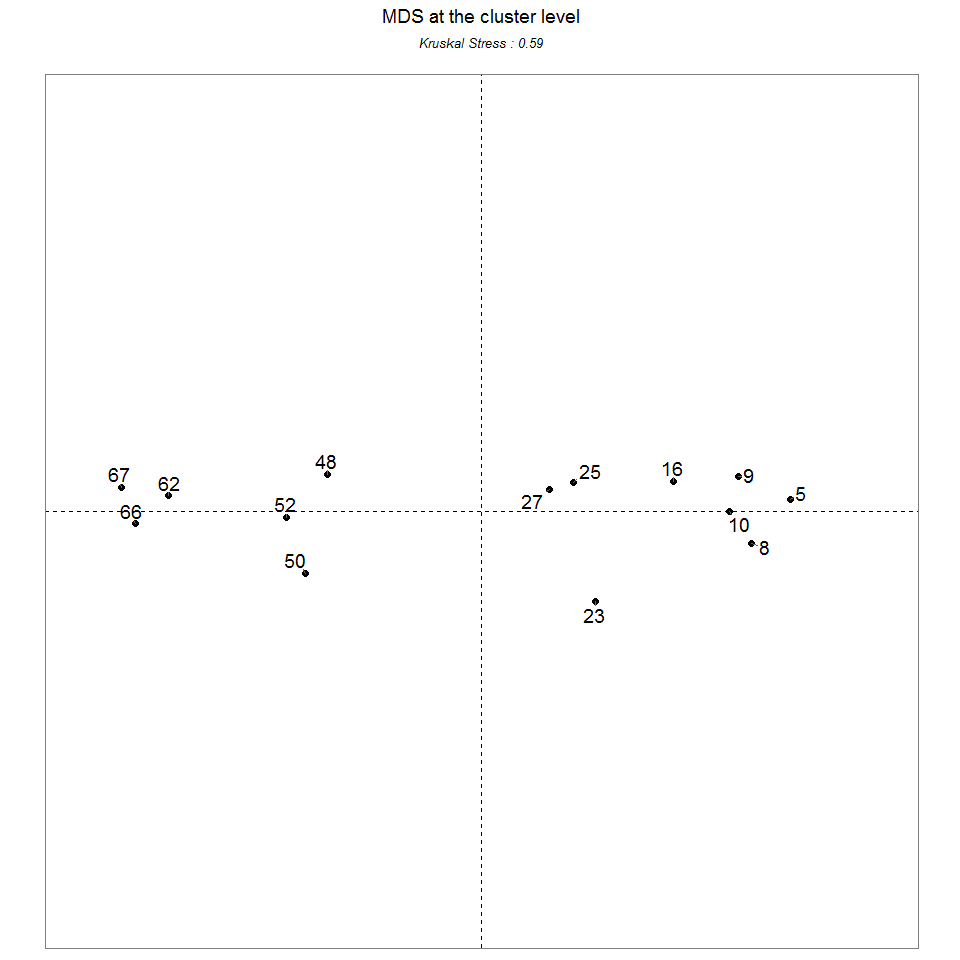
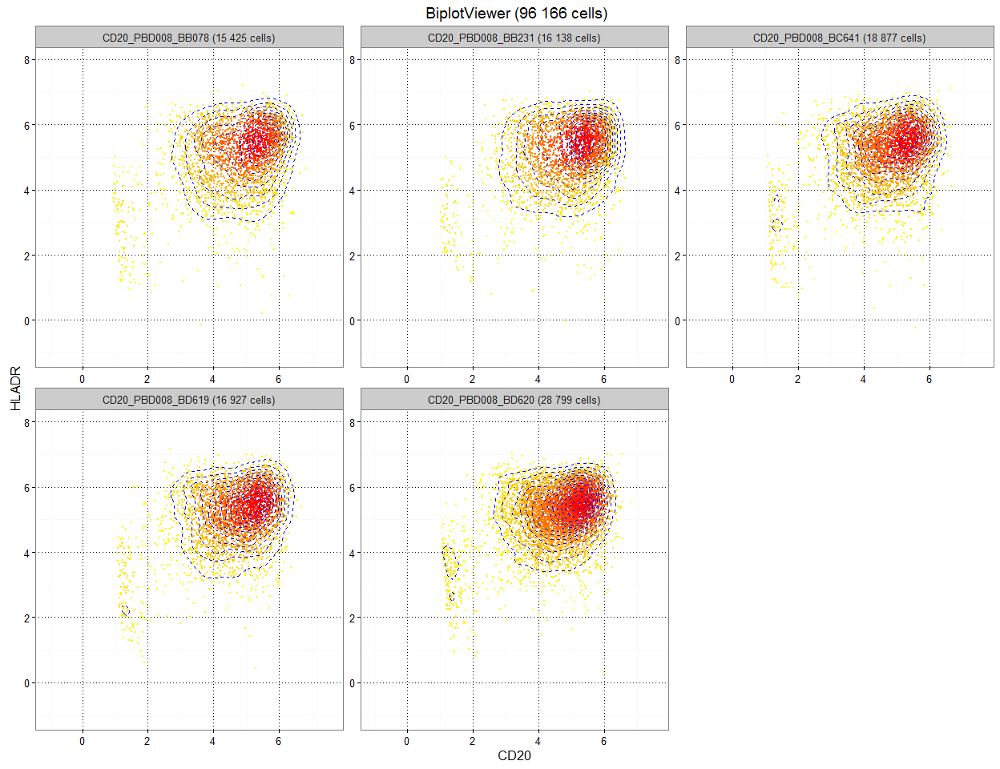

# SPADEVizR: an R package for the visualization and analysis of SPADE clustering results
Guillaume Gautreau and Nicolas Tchitchek  


# Table of Contents
1.  [Package overview](#package_overview)
2.  [Package installation](#package_installation)
3.  [Importing automatic gating results](#loading_data)
	1.  [Importing results from SPADE](#loading_SPADE_data)
	2.  [Importing results from other algorithms](#loading_other_data)
4.  [Statistical analyses](#stat_functions)
	1.  [Computation of abundant clusters](#stat_function_identifyAC)
	2.  [Computation of differentially enriched clusters](#stat_function_identifyDEC)
	3.  [Computation of correlated Clusters](#stat_function_identifyCC)
	4.  [Classification of Clustering Results](#stat_function_classify_clustering_results)
6.  [Visual representations](#viewer_functions)
	1.  [Vizualisation of the number of cells associated to each cluster (Count Viewer)](#count_viewer_function)
	2.  [Vizualisation of combined SPADE trees (Tree Viewer)](#tree_viewer_function)
	3.  [Vizualisation of clusters phenotypes using categorical heatmap (Heatmap Viewer)](#heatmap_viewer_function)
	4.  [Vizualisation of clusters abundance in different biological conditions (Boxplot Viewer)](#boxplot_viewer_function)
	5.  [Vizualisation of cell cluster abundance kinetics (Kinetics Viewer)](#kinetics_viewer_function)
	6.  [Vizualisation of cell clusters dynamics as a streamgraph (Streamgraph Viewer)](#streamgraph_viewer_function)
	7.  [Vizualisation of cell clusters using parallels coordinates (Pheno Viewer)](#pheno_viewer_function)
	8.  [Visualisation of sample or cluster similarities using Multidimensional Scaling (MDS Viewer)](#MDS_viewer_function)
	9.  [Visualisation of marker co-expressions using a biplot representation (Biplot Viewer)](#biplot_viewer_function)
	10. [Visualisation of marker co-expressions using a distogram (Distogram Viewer)](#distogram_viewer_function)
6.  [Export](#export)
7.  [Generate report](#report)
8.  [Object structures](#object_structures)
	1.  [UML diagram](#object_structure_uml)
	2.  [Results object](#object_structure_results)
	3.  [SPADEResults object](#object_structure_SPADE_results)
	4.  [Abundant clusters (AC object)](#object_structure_AC)
	5.  [Differentially enriched clusters (DEC object)](#object_structure_DEC)
	6.  [Correlated clusters (CC object)](#object_structure_CC)
	7.  [Classification of Clustering Results (CCR object)](#object_structure_CCR)
9.  [License](#license)
10. [References](#references)

# <a name="package_overview"/> 1. Package overview

Flow and mass cytometry ([CyTOF](https://www.fluidigm.com/products/cytof) [1]) are experimental techniques used for the characterization of cell at a single cell level.
The increase of measurable cell markers (up to 50 markers) has lead to the developpement of computation approachs to identify groups of cells having similar expressions for selected markers.
Different automatic gating algorithms has been proposed such as SPADE [1], VSNE [X], ACCENCE [X] to analyse and explore mass-cytometry data.
Among them the SPADE algorithm is a popular pipeline to analysis and explore mass-cytometry data.
This algorithm performs a density-based down-sampling combined with an agglomerative hierarchical clustering to identify to identify the cell clusters.

The SPADE algorithm, which stands for Spanning Tree Progression of Density Normalized Events, was developed to identify clusters of cells having similar phenotypes in mass cytometry data.
SPADE is an hierarchical clustering-based algorithm combined to a density-based down-sampling procedure. 

In summary, SPADE is working as the following: 

 1. All cytometry profiles (samples) are density dependent down-sampled and merged into a single matrix;
 2. A hierarchical agglomerative clustering is performed to identify cell clusters having similar expressions for selected markers;
 3. A minimal spanning tree structure is build to represent and link the identifed cell clusters;
 4. An up-sampling procedure is performed to associate all cells their closest cell cluster.
 
SPADE results can be mainly summarized by two numeric matrices: 

 * The 'cluster phenotype matrix' contains the marker median expressions for each cell cluster;
 * The 'count matrix' contains the number of cell associated to each cell cluster for each sample.

SPADE offers strong opportunities to deal with high-dimensional cytometry data but additional visualization features and statistical approaches can improve the interpretation of the clustering results. 

We extended the original SPADE visualization outputs with visualization techniques such as parallel coordinates, multidimensional scaling, volcano plots or streamgraph representations using the ggplot2 library [3].
For instance, parallel coordinates can efficiently displayed the marker expression profiles of each cell cluster.
Multidimensional scaling and streamgraph representations provide overviews of cell cluster similarities and behaviors.
In addition, SPADEVizR can identify cell populations with relevant biological behaviors. This package allows to identify: 
(i) clusters with an abundance statistically greater than a specific threshold for a given condition; 
(ii) clusters having a different enrichment between two biological conditions; 
(iii) clusters having an abundance correlating with any biological variable. Cell clusters can also be classified to identified those having similar phenotypes or abundances in the dataset. 

SPADEVizR has been designed in a way by both biologist and data analyst can interpret more easily the results provided by SPADE.
Moreover, SPADEVizR can be used with cell clustering results from any automatic gating algorithm (as long as a 'cluster phenotype matrix' and a 'count matrix' can be provided).

SPADEVizR has six S4 objects to handle the clustering results inputs and analyses results (`Results`, `SPADEResults`, `AC`, `DEC`, `CC`, `CCR` objects).
These objects are detailed in the section [8. Object structures](#object_structures). 

# <a name="package_installation"/> 2. Package installation
The `data.table`, `ggdendro`, `ggnetwork`, `ggplot2`, `ggrepel`, `grid`, `gridExtra`, `gtools`, `igraph`, `MASS`, `reshape2`,  R packages as well as the `flowCore` [4] Bioconductor packages are required for running SPADEVizR. These packages can be installed using the following commands:

```r
install.packages('data.table')
install.packages('ggnetwork')
install.packages('ggplot2')
install.packages('ggrepel')
install.packages('ggdendro')
install.packages('grid')
install.packages('gridExtra')
install.packages('gtools')
install.packages('igraph')
install.packages('MASS')
install.packages('scales')
install.packages('reshape2')

source("http://bioconductor.org/biocLite.R")
biocLite(suppressUpdates=TRUE)
biocLite("flowCore",suppressUpdates=TRUE)
```

SPADEVizR is available on [GitHub](https://github.com), at https://github.com/tchitchek-lab/SPADEVizR. Its installation can be done via the `devtools` package using the following commands:

```r
install.packages('devtools')
library("devtools")
install_github('tchitchek-lab/SPADEVizR')
```

Once installed, SPADEVizR can be loaded using the following command:

```r
library("SPADEVizR")
```


# <a name="loading_data"/> 3. Importing automatic gating results

## <a name="loading_SPADE_data"/> 3.1 Importing results from SPADE

The `importSPADEResults()` function imports cell clustering results generated by the SPADE algorithm. The function returns a `Results` object. Such import of SPADE clustering results can be done using the following command:


```r
SPADEResults  <- importSPADEResults("ImMemoryB-#00008_[MARKERSET10]_K070_P025")
```

*Optional:* The markers of SPADE results can be renamed using a dataframe (called dictionary). 
Such kind of dataframe must have in the first column the original marker names (metals or fluorochromes) and have in the second column the new marker names (protein markers). 

For instance, a dictionary can be loaded using the following command:

```
##         metal      marker
## 1        Time        time
## 2 Cell_length cell_length
## 3        Cell      length
## 4   (Rh103)Di        Live
## 5   (Ce140)Di    beads140
```

Once a dictionary has been defined, SPADE clustering results can be loaded using in addition the `dictionary` parameter. 

Specific markers can be excluded from the import procedure by providing their names to the `exclude.markers` parameter. 
By default these four markers are excluded: "cell_length", "FileNum", "density", "time". The `quantile.approximation` parameter (set by default to `FALSE`) can be used to approximate the computation of maker range quantiles. 
By this way the importation will be more efficient in term of loading time and memory usage. 

For instance, an import of a SPADE result using a dictionary and by excluding the "cell_length", "FileNum", "density", "time", and "Live" markers can be done using the following command:

```r
results  <- importSPADEResults("ImMemoryB-#00008_[MARKERSET10]_K070_P025",
							   dictionary             = dictionary,
							   quantile.approximation = TRUE,
							   exclude.markers        = c("cell_length", "FileNum", "density", "time", "Live"))
## [START] - extracting SPADE results
## ImMemoryB-#00008_[MARKERSET10]_K070_P025
## FCS files loading:
## 	archsin transform...
## 	compute quantiles...
## 	reading SPADE results...
## [END] - extracting SPADE results
```

## <a name="loading_other_data"/> 3.2 Importing results from other algorithms
SPADEVizR functionnalities can be used from results obtained from any cell clustering algorithms, using the `importResults()` function. This function returns a `Results` object and takes 2 dataframes in parameters: `cells.count` and `marker.expressions`.

 * `cells.count` is a dataframe containing the number of cells associated to each cluster for each sample. This dataframe must be formated with cluster names in rownames as bellow: 

*rownames*| sample1 | sample2| ...
----------|---------|--------|----
cluster1  | 749     | 5421   | ...
cluster2  | 450     | 412    | ...
...       | ...     | ...    | ...

 * `marker.expressions` is a dataframe containing the marker median expressions for each cluster of each sample. This dataframe must be formated as bellow:

sample   | cluster  | marker1  | marker2| ...
---------|----------|----------|--------|-----
sample1  | cluster1 | 0.2      | 0.3    | ...
sample1  | cluster2 | 0.1      | 0.3    | ...
sample2  | cluster1 | 0.5      | 2.3    | ...
sample2  | cluster2 | 1        | 1.3    | ...
...      | ...      | ...      | ...    | ...

For instance, an import of cell clustering results obtained from a specific automatic gating algorithm can be done using the following command:

```r
cells.count        <- read.delim("cells_count.txt", sep = "\t")
marker.expressions <- read.delim("marker_expressions.txt", sep = "\t")

head(cells.count)
##          sample1 sample2
## cluster1     749    5421
## cluster2     450     412
head(marker.expressions)
##    sample  cluster marker1 marker2
## 1 sample1 cluster1     0.2     0.3
## 2 sample1 cluster2     0.1     0.3
## 3 sample2 cluster1     0.5     2.3
## 4 sample2 cluster2     1.0     1.3

results_other <- importResults(cells.count =  cells.count, marker.expressions = marker.expressions)
```

`Results` objects can be used by all functions excepting by the `treeViewer()` and `biplotViewer()` which only accept a `SPADEResults` object.

# <a name="stat_functions"/> 4. Statistical analyses

## <a name="stat_function_identifyAC"/> 4.1 Computation of abundant clusters
The `identifyAC()` function identify clusters with a number of associated cells statistically greater than a specific threshold in a biological condition. The `identifyAC()` function returns a `AC` object which can be ploted.

The `identifyAC()` function takes as parameter: a `Results` or `SPADEResults` object and a named logical vector `condition` specifying the samples to use in the statistical computation. 
This named vector must provide the correspondence between samples (in names) and logical values `TRUE`. 
Significant abundant clusters are characterized by two thresholds: the p-value threshold (`th.pvalue` parameter, set by default to `0.05`) and the mean abundance threshold (`th.mean` parameter, set by default to `0`).

For instance, the identification of clusters statistically greater than 1% of all clusters in the selected samples with a p-value < 0.05 can be done using the following command:

```r
samples <- c(CD20_PBD008_BB078 = TRUE, CD20_PBD008_BB231 = TRUE, CD20_PBD008_BC641 = TRUE, CD20_PBD008_BD619 = TRUE, CD20_PBD008_BD620 = TRUE)
resultsAC <- identifyAC(results, samples = samples, th.pvalue = 0.05, th.mean = 1)
## [START] - computing ACs
## Samples used :
## CD20_PBD008_BB078
## CD20_PBD008_BB231
## CD20_PBD008_BC641
## CD20_PBD008_BD619
## CD20_PBD008_BD620
## [END] - computing ACs
print(resultsAC)
## Object class: Abundant Clusters (AC)
## Samples: CD20_PBD008_BB078; CD20_PBD008_BB231; CD20_PBD008_BC641; CD20_PBD008_BD619; CD20_PBD008_BD620
## Use matrix of percent: TRUE
## Statistical test used is: t.test
## Adjusted: none
## P-value threshold:  0.05
## Mean threshold:  1
```

This returned `AC` object can be plotted to visualize identified abundant clusters using the `plot()` function. 
This representation displays the p-value (shown as -log10(p-value)) in the X-axis and the mean of cells abundance in the Y-axis in a two dimensional chart. 
Each dot represents a cluster and both p-value and mean thresholds are shown using red dashed lines. 
Significant abundant clusters are highlighted in red. The size of dots is proportional to the number of associated cells in the samples considered.

For instance, results contained in an `AC` object can be shown using the following command:

```r
plot(resultsAC)
```


## <a name="stat_function_identifyDEC"/> 4.2 Computation of differentially enriched clusters
The `identifyDEC()` function identify clusters with a number of associated cells statistically different between two biological conditions. The `identifyDEC()` function returns a `DEC` object which can be ploted.

The `identifyDEC()` function takes as parameter: a `Results` or `SPADEResults` object and a named numeric vector `conditions` specifying the samples to consider in the two conditions. This named vector must provide the correspondence between samples (in names) and conditions (`1` to specify the first biological condition, `2` to indicate the second biological condition and `NA` otherwise). Differentially enriched clusters are characterized by two thresholds: the p-value threshold (`th.pvalue` parameter, set by default to `0.05`) and the fold-change threshold (`th.fc` parameter, set by default to `1`).

For instance, the identification of clusters differentially enriched with a fold-change greater than 2 in the selected conditions with a p-value < 0.05 can be done using the following command:

```r
conditions <- c(CD20_PBD008_BB078 = 1, CD20_PBD008_BB231 = 1, CD20_PBD008_BC641 = 1, CD20_PBD028_BB078 = 2, CD20_PBD028_BB231 = 2, CD20_PBD028_BC641 = 2)
resultsDEC <- identifyDEC(results, conditions = conditions, th.pvalue = 0.05, th.fc = 2)
## [START] - computing DECs
## cond1:
## CD20_PBD008_BB078
## CD20_PBD008_BB231
## CD20_PBD008_BC641
## cond2:
## CD20_PBD028_BB078
## CD20_PBD028_BB231
## CD20_PBD028_BC641
## [END] - computing DECs
print(resultsDEC)
## Object class: Differentially Enriched Clusters (DEC)
## Sample of Condition 1: CD20_PBD008_BB078; CD20_PBD008_BB231; CD20_PBD008_BC641
## Sample of Condition 2: CD20_PBD028_BB078; CD20_PBD028_BB231; CD20_PBD028_BC641
## Use matrix of percent: TRUE
## Statistical test used is: t.test
## Adjusted: none
## Paired: FALSE
## P-value threshold:  0.05
## Fold-change threshold:  2
```

This returned `DEC` object can be plotted to visualize identified differentially enriched clusters using the `plot()` function. 
The volcano plot [6] representation displays the p-value (shown as -log10(p-value)) in the Y-axis and the fold-change of cell abundances in the X-axis in a two dimensional chart. 
Each dot represents a cluster, threshold are shown using red dashed lines and differentially enriched clusters are shown in red. 
The size of dots is proportional to the number of associated cells in the 2 conditions merged.

By default, the fold-change is represented with a log2 transformation (which can be changed using the `fc.log2` parameter).

For instance, results contained in an `DEC` object can be shown using the following command:

```r
plot(resultsDEC, fc.log2 = FALSE)
```


## <a name="stat_function_identifyCC"/> 4.3 Computation of correlated clusters
The `identifyCC()` function identify clusters correlated with an additional phenotypical variable. The `identifyCC()` function returns a `CC` object which can be ploted.

The `identifyCC()` function takes as parameter: a `Results` or `SPADEResults` object and a named numeric vector `variable` specifying the expression values of the external biological variable. 
This named vector must provide the correspondence between samples (in names) and the expression values (`NA` to exclude this sample from analysis). 
Significant correlated clusters are caracterized by two thresholds: the p-value threshold (`th.pvalue` parameter, set by default to `0.05`) and the coefficient of correlation (R) threshold (`th.correlation` parameter, set by default to `0.7`).

For instance, the identification of clusters statistically correlated with the provided numerical vector above a coefficient of correlation of 0.8 and with a p-value < 0.05 can be done using the following command:

```r
variable <- c(CD20_PBD008_BB078 = 8, CD20_PBD008_BB231 = 1.7, CD20_PBD008_BC641 = 4, CD20_PBD008_BD619 = 23, CD20_PBD008_BD620 = 10)
resultsCC <- identifyCC(results, variable = variable, th.pvalue = 0.05, th.correlation = 0.8)
## [START] - computing CCs
## [END] - computing CCs
print(resultsCC)
## Object class: Correlated Clusters (CC)
## Samples: CD20_PBD008_BB078; CD20_PBD008_BB231; CD20_PBD008_BC641; CD20_PBD008_BD619; CD20_PBD008_BD620
## Phenotypic variables: 8; 1.7; 4; 23; 10
## Use matrix of percent: TRUE
## Statistical test used is: pearson
## Adjusted : none
## P-value threshold: 
##  0.05
## Correlation threshold: 
##  0.8
```

This returned `CC` object can be plotted to visualize correlated clusters using the `plot()` function. This representation displays the p-value (shown as -log10(p-value)) in the Y-axis and the correlation coefficient in the X-axis in a two dimensional chart. Each dot represents a cluster, threshold are shown using red dashed lines and correlated clusters are shown in red. The size of dots is proportional to the number of associated cells in the samples considered.

For instance, results contained in an `CC` object can be shown using the following command:

```r
plot(resultsCC)
```


## <a name="stat_function_classify_clustering_results"/> 4.4 Classification of Clustering Results

The `classifyClusteringResults()` function takes a `Results` or `SPADEResults` object and classifies each cell cluster in different groups. Classification can be done based on phenotype profiles or enrichment profiles. This type of profile is specify using the `type` parameter wich take value "phenotype" or "enrichment".

Differents classification methods are available among:

 * `hierarchical_h` (by default):
This method performs a hierarchical clustering based on the Person correlation matrix and the resulting dendrogram is cutted at the specified height.  
This heigth is a correlation threshold (a numeric double between 0 and 1 included, default is 0.7) provided using the `method.parameter` parameter.
 * `hierarchical_k`:
This method also performs a hierarchical clustering based on the Person correlation matrix and the resulting dendrogram is cutted in order to return the desired number of classes. 
This number of classes must be provided as a numeric integer using the `method.parameter` parameter.
 * `k-means`: 
This method perform a k-means partition of the clusters based on the `kmeans()` function. The number of desired classes must be specify using the `method.parameter`.
 * `eigencell`:
This method performs an eigen vector decomposition and then calculate the correlations between cluster values and these vectors.
Clusters which correlate above a specific threshold with the same eigen vector are classified together.
This correlation threshold (a numeric double between 0 and 1 included, default is 0.8) provided using the `method.parameter` parameter.
 * `clique`:
This method first compute the Pearson correlation matrix and then use this matrix to generate an undirected graph.
In this graph, an edge is drawn between two nodes if the correlation coefficient in the adjacency matrix is above a specific threshold. 
This correlation threshold (a numeric double between 0 and 1 included, default is 0.7) provided using the `method.parameter` parameter.
After building the graph, the method looking for the largest cliques wich are considered as classes of nodes. Cliques correspond to subgraph in which every two distinct vertices are adjacent.

For instance, cell clusters can be classified via a hierarchical clustering, based on their phenotype profiles, using the following command: 

```r
# performs a hierarchical clustering of cell clusters (dendrogram will be cutted at a correlation threshold of 0.9)
results_CCR_phenotypes <- classifyClusteringResults(results, type = "phenotype", method = "hierarchical_h", method.parameter = 0.9) 
## [START] - computing classifyClusteringResults
## [END] - computing classifyClusteringResults
print(results_CCR_phenotypes)
## Object class: CRR
## type: phenotype
## Number of class: 8
## Classification method used: hierarchical_h
## Parameter used = 0.9
```

In the same way, cell clusters can be classified via a k-means, based on their enrichment profiles, using the following command: 

```r
# performs a k-means to identify 9 classes of clusters
results_CCR_enrichment <- classifyClusteringResults(results, type = "enrichment", method = "k-means", method.parameter = 9)
## [START] - computing classifyClusteringResults
## [END] - computing classifyClusteringResults
print(results_CCR_enrichment)
## Object class: CRR
## type: enrichment
## Number of class: 9
## Classification method used: k-means
## Parameter used = 9
```

The `classifyClusteringResults()` function returns a `CCR` (Classification of Clustering Result) object containing the cluster classification. This object can be plotted to visualize the groups of clusters using the `plot()` function. Groups of clusters are represented using circular graphs where each node represents a cell cluster and where edges connect cell clusters of the same class. 

For instance, the previously created `CCR` objects can be displyed using the following commands:

```r
plot(results_CCR_phenotypes)
## Loading required package: sna
## sna: Tools for Social Network Analysis
## Version 2.3-2 created on 2014-01-13.
## copyright (c) 2005, Carter T. Butts, University of California-Irvine
##  For citation information, type citation("sna").
##  Type help(package="sna") to get started.
## Loading required package: network
## network: Classes for Relational Data
## Version 1.13.0 created on 2015-08-31.
## copyright (c) 2005, Carter T. Butts, University of California-Irvine
##                     Mark S. Handcock, University of California -- Los Angeles
##                     David R. Hunter, Penn State University
##                     Martina Morris, University of Washington
##                     Skye Bender-deMoll, University of Washington
##  For citation information, type citation("network").
##  Type help("network-package") to get started.
## 
## Attaching package: 'network'
## The following object is masked from 'package:sna':
## 
##     %c%
```


```r
plot(results_CCR_enrichment)
```


# <a name="#viewer_functions"/> 6. Visual representations

## <a name="count_viewer_function"/> 6.1 Vizualisation of the number of cells associated to each cluster (Count Viewer)

The Count Viewer aims to visualize the number of cells in each cluster. 
This representation displays the clusters (in X-axis) and the number of associated cells (in Y-axis) in a two dimensional visualization. 

This representation can be displayed using the `countViewer()` function and takes a `Results` or `SPADEResults` object in input. 
By default, all clusters will be displayed but the representation be restricted to a set of selected clusters (using `clusters` parameter).

For instance, such representation can be generated using the following command: 

```r
# The following command describe how to select samples
samples <- c(CD20_PBD008_BB078 = TRUE, CD20_PBD008_BB231 = TRUE, CD20_PBD008_BC641 = TRUE, CD20_PBD008_BD619 = TRUE, CD20_PBD008_BD620 = TRUE)
countViewer(results, samples = samples, clusters = c("1","8","7","4","5","6","3","19","45","22"))
```


It is to note that the function computes the sum of all samples by default but allows to select the samples (using `samples` parameter) which are used to calculate the number of cells in each cluster.

## <a name="tree_viewer_function"/> 6.2 Vizualisation of combined SPADE trees (Tree Viewer)

The Tree Viewer aims to visualize the SPADE tree representation. 
This representation displays the identified cell clusters using a minimal spanning tree layout. 
In such tree each node respresent a cell cluster and nodes are linked based on their phenotype similarities. 
Node sizes are proportional to number of associated cells. 

This representation can be displayed using the `treeViewer()` function and takes a `Results` object in input. 
This viewer improves the original SPADE tree representation by allowing to combine trees from several samples. 
It is possible to highlight significant clusters (node borders are collored in blue) by providing a `DEC`, `AC` or `CC` object (using the `highligth` parameter).
As with the original SPADE tree representation nodes can be colored by the marker median expression of a selected marker (using the `marker` parameter). 
It is to note than this function can only handle `SPADEResults` objects (but not `Results` objects). 

For instance, such representation can be generated using the following command:

```r
# The following command describe how to select samples
samples <- c(CD20_PBD008_BB078 = TRUE, CD20_PBD008_BB231 = TRUE, CD20_PBD008_BC641 = TRUE, CD20_PBD008_BD619 = TRUE, CD20_PBD008_BD620 = TRUE)
treeViewer(results, samples = samples, highlight = resultsDEC, marker = "HLADR")
```


## <a name="heatmap_viewer_function"/> 6.3 Vizualisation of clusters phenotypes using categorical heatmap (Heatmap Viewer)

The Heatmap Viewer aims to visualize an overview of all clusters phenotypes. 
This representation displays marker expressions of all clusters using a categorical heatmap. 
The range expression of each cell marker is discretized in several categories.
The marker expression of each cluster is then assigned to a category.

This representation can be displayed using the `heatmapViewer()` function and takes a `Results` or `SPADEResults` object in input. 
In this viewer, both cell clusters and cell markers are clustered using a hierarchical clustering.

For instance, such representation can be generated using the following command:

```r
heatmapViewer(results)
```


It is to note that the markers used by SPADE as clustering markers are shown in bold.

## <a name="boxplot_viewer_function"/> 6.4 Vizualisation of clusters abundance in different biological conditions (Boxplot Viewer)

The Boxplot Viewer aims to visualize and compare the cell cluster abundances between several biological conditions.
This representation displays cell cluster abundances using boxplots.

This representation can be displayed using the `boxplotViewer()` function and takes a `Results` or `SPADEResults` object in input.
The biological conditions must be specified using the `conditions` parameter. 
This parameter must be a named vector providing the correspondence between a sample and the biological condition.
The cell cluster abundances could be displayed as percentages or absolute numbers using the `use.percentages` parameter (TRUE by default).

For instance, such representation can be generated using the following command:

```r
# The following command describe how to assign conditions to samples
conditions <- c(CD20_PPD000_BB078 = "day 00", CD20_PPD000_BB231 = "day 00", CD20_PPD000_BC641 = "day 00",
				CD20_PBD008_BB078 = "day 08", CD20_PBD008_BB231 = "day 08", CD20_PBD008_BC641 = "day 08",
				CD20_PBD028_BB078 = "day 28", CD20_PBD028_BB231 = "day 28", CD20_PBD028_BC641 = "day 28")
boxplotViewer(results, show.legend = TRUE, conditions = conditions, clusters = c("1","3"))
```


## <a name="kinetics_viewer_function"/> 6.5 Vizualisation of cell cluster abundance kinetics (Kinetics Viewer)

The Kinetics Viewer aims to visualize the cell cluster abundances in a kinetics manner. 
This representation displays the cell abundances over the time for each individual using colored lines. 

This representation can be displayed using the `kineticsViewer()` function and and takes a `Results` or `SPADEResults` object in input. 
The timepoints and individuals must be specified using the `assignments` parameter. 
This parameter must be a dataframe with sample names in row names and 2 other columns specifying the timepoints and individuals. 
The cell cluster abundances could be displayed as percentages or absolute numbers using the `use.percentages` parameter (TRUE by default).

For instance, such representation can be generated using the following command:

```r
# The following command describe how to visualize the kinetics associated with the contextual informations provided in the `assignments` parameter
assignments <- data.frame(row.names = c("CD20_PPD000_BB078", "CD20_PPD000_BB231", "CD20_PPD000_BC641", "CD20_PBD008_BB078", "CD20_PBD008_BB231", "CD20_PBD008_BC641", "CD20_PBD028_BB078", "CD20_PBD028_BB231", "CD20_PBD028_BC641"),
						  timepoints = c(0, 0, 0, 8, 8, 8, 28, 28, 28),
						  individuals = c("BB078", "BB231", "BC641", "BB078", "BB231", "BC641", "BB078", "BB231", "BC641"))

kineticsViewer(results, assignments = assignments, clusters = c("1", "3"))
```


## <a name="streamgraph_viewer_function"/> 6.6 Vizualisation of cell clusters dynamics as a streamgraph (Streamgraph Viewer)

The Streamgraph Viewer aims to visualize both absolute and relative abundance of clusters across the samples.
This representation displays cell abundance using a stacked area graph which is displaced around a central axis.

This representation can be displayed using the `streamgraphViewer()` function and takes a `Results` or `SPADEResults` object in input.
The cell clusters to represent must be specified using the `clusters` parameter. 
Moreover, specific samples to represent and the sample order can specified using the `sample.order` parameter.

For instance, such representation can be generated using the following command:

```r
sample.order <- c(CD20_PPD000_BB078 = 1, CD20_PBD008_BB078 = 2, CD20_PBD028_BB078 = 3)
streamgraphViewer(results, sample.order = sample.order, clusters = c("1", "3", "4", "7", "8"))
```


```r
# The same could be done in a relative manner using the `use.relative = TRUE` parameter
streamgraphViewer(results, sample.order = sample.order, clusters = c("1", "3", "4", "7", "8"), use.relative = TRUE)
```


## <a name="pheno_viewer_function"/> 6.7 Vizualisation of cell clusters using parallels coordinates (Pheno Viewer)

The Pheno Viewer aims to visualize the median expressions of each marker for each cluster.
This representation displays cell cluster phenotypes using parallels coordinates. 
In such representation, each line represent a biological sample and lines are prepositioned on a space where the x-axis represents the cell marker and the y-axis represent the marker expression.

This representation can be displayed using the `phenoViewer()` function and takes a `Results` or `SPADEResults` object in input.
Importantly, a ribbon and a dashed line indicates respectively the desired percentiles and mean of expressions for each cell marker.
The visualization can be restricted to specific markers and clusters by using the `clusters` and `markers` parameters.

For instance, such representation can be generated using the following command:

```r
phenoViewer(results,clusters = c("1","8"))
```


It is to note that the markers used by SPADE as clustering markers are shown in bold.

## <a name="MDS_viewer_function"/> 6.8 Visualisation of sample or cluster similarities using Multidimensional Scaling (MDS Viewer)

Multidimensional Scaling (MDS) methods aim to represent the similarities and differences among high-dimensional objects into a space of a lower dimensions, generally in two or three dimensions for visualization purposes [5]. In MDS representations, the Kruskal Stress (KS) indicates the percentage of information lost during the dimensionality reduction process.

The MDS Viewer aims to visualize the similarities between samples or clusters based on their abundances. 
In such representation, each dot represent a sample or a marker and the distance between the dot are proportional to the euclidian distance between this objects.

This representation can be displayed using the `MDSViewer()` function and takes a `Results` object in input.
The representation space can be specified using the `space` parameter  ("samples" or "clusters").
The `assignments` parameter can be used to specify the biological condition associated to each sample.
This parameter must be a dataframe with sample names in row names and 2 other columns specifying the timepoints and individuals. 

It is to note than this function can only handle `SPADEResults` objects (but not a `Results` object). 

For instance, such representation can be generated using the following command:

```r
MDSViewer(results, space = "clusters", clusters = c("2","3","4","5","6","7","9"))
```



```r
# The following command describe how to visualize the distances between all samples associated with the contextual informations provided in the `assignments` parameter
assignments <- data.frame(row.names = c("CD20_PPD000_BB078", "CD20_PPD000_BB231", "CD20_PPD000_BC641", "CD20_PBD008_BB078", "CD20_PBD008_BB231", "CD20_PBD008_BC641", "CD20_PBD028_BB078", "CD20_PBD028_BB231", "CD20_PBD028_BC641"),
						  timepoints = c(0,0,0,8,8,8,28,28,28),
						  individuals = c("BB078","BB231","BC641","BB078","BB231","BC641","BB078","BB231","BC641"))
MDSViewer(results, space = "samples", assignments = assignments, clusters = c("2","3","4","5","6","7","9"))
```


## <a name="biplot_viewer_function"/> 6.9 Visualisation of marker co-expressions using a biplot representation (Biplot Viewer)

The Biplot Viewer aims to visualize co-expressions between 2 markers using a biplot representation. 
In such representation, each cell is represented by dot which positionated in a two dimensional space where the 2 axis correspond to the marker expressions.

This representation can be displayed using the `biplotViewer()` function and takes a `SPADEResults` object in input. 
Cells from specific clusters or samples can be selected using the `clusters` and `samples` parameters. 
Moreover, samples can be displayed independently (default) or merged.
In order to seep up the computation, the number of cells to display can be down-sampled using the `resample.ratio` parameter.  
It is to note than this function can only handle `SPADEResults` objects (but not `Results` objects).

For instance, such representation can be generated using the following command:

```r
# To visualize the biplots using "CD20" and "HLADR" markers filtered by the selected sample and clusters
samples <- c(CD20_PBD008_BB078 = TRUE, CD20_PBD008_BB231 = TRUE, CD20_PBD008_BC641 = TRUE, CD20_PBD008_BD619 = TRUE, CD20_PBD008_BD620 = TRUE)
biplotViewer(results, x.marker = "CD20", y.marker = "HLADR", samples = samples, clusters = c("1","8","7","4","5","6","3","19","45","22"))
## Biplot computation
## done
```



## <a name="distogram_viewer_function"/> 6.10 Visualisation of marker co-expressions using a distogram (Distogram Viewer)

The Distogram Viewer aims to visualize the co-expressions of all markers using a distogram. 
In such representation each tile of the distogram correspond to the coexpression between 2 markers.
Each tile is gradient-colored based on the Pearson correlation of those 2 makers.

This representation can be displayed using the `distogramViewer()` function and takes a `Results` or `SPADEResults` object in input. 
The visualization can be restricted to specific clusters, samples and markers by using the `clusters`, `samples` and `markers` parameters.

For instance, such representation can be generated using the following command:

```r
samples <- c(CD20_PBD008_BB078 = TRUE, CD20_PBD008_BB231 = TRUE, CD20_PBD008_BC641 = TRUE, CD20_PBD008_BD619 = TRUE, CD20_PBD008_BD620 = TRUE)
distogramViewer(results, samples = samples, clusters = c("1","8","7","4","5","6","3","19","45","22"))
```


It is to note that the markers used by SPADE as clustering markers are shown in bold.

# <a name="export"/> 7. Export 
All SPADEVizR objects can be exported to tab separated file using the `export()` function.
Then, those tab separated files can be open with Microsoft Excel© or with Libre Office Calc.

For instance, such export can be done using the following command:

```r
export(AC,filename = "export.txt")
```

# <a name="report"/> 8. Generate report 
The `generateReport()` function allows to easily generate a PDF file containing all desired plots. In order to select the plots to include in the report, you could provided a character vector containing the names of desired plots to the `plot.names` parameter among: 

 * "[count](#count_viewer_function)" (included by default): Display an representation showing the number of cells for each cluster
 * "[tree](#tree_viewer_function)" (included by default): Display a tree representation showing combined SPADE trees
 * "[heatmap](#heatmap_viewer_function)" (included by default): Display an heatmap representation
 * "[boxplot](#boxplot_viewer_function)": Display a boxplot representation. This plot required to provide the 'conditions' parameter
 * "[kinetics](#kinetics_viewer_function)": Display a kinetic representation for each cluster. This plot required to provide the 'assignments' parameter
 * "[stream](#streamgraph_viewer_function)": Display a streamgraphViewer representation showing the evolution of cells abundance
 * "[pheno](#pheno_viewer_function)" (included by default): Display a parallel coordinate representation showing for each cluster the marker median expression
 * "[MDSclusters](#MDS_viewer_function)" (included by default): Display the cluster similarities using MDS
 * "[MDSsamples](#MDS_viewer_function)": Display the samples similarities using MDS. This plot required to provide the 'assignments' parameter
 * "[disto](#distogram_viewer_function)" (included by default): Display a distogram representation showing the marker co-expressions
 * "kinetics_cluster": Display a "[kinetics](#kinetics_viewer_function)" and "[cluster](#cluster_viewer_function)" representation juxtaposed (are arranged one on the side of the other) for each cluster.
 * "boxplot_cluster": Display a "[boxplot](#boxplot_viewer_function)" and "[cluster](#cluster_viewer_function)" representation juxtaposed (are arranged one on the side of the other) for each cluster.

The report will follows the order of plot names in the vector.

You can also provided an objects vector of class `AC`, `DEC`, `CC` and `CCR` objects with the `stat.objects` parameter.

For instance, such kind of report can be generated using the following command:

```r
generateReport(results, PDFfile = "report.pdf", assignments = assignments, plot.names = c("heamap", "kinetics_pheno", "tree", "disto", "MDSsamples", "MDSclusters"), stat.objects = c(resultsAC, resultsDEC, resultsCC, results_CCR_phenotypes))
```

The generated PDF file can be download here <a href="report.pdf"> report.pdf </a>

*Generating a big report can take a minute or more.*

# <a name="object_structures"/> 9. SPADEVizR objects

## <a name="object_structure_uml"/> 9.1 Overview of SPADEVizR objects

In SPADEVizR, six objects are available: `Results`, `SPADEResults`, `AC` (Abondant Cluster), `DEC` (Differentially Enriched Clusters), `CC` (Correlated Clusters) and `CCR` (Classification of Clustering Results).

The following UML diagram summurize the structure of those objects:


The `print` and `show` functions are available for all objects of this package.

## <a name="object_structure_results"/> 9.2 Results object 
The `Results` object is a S4 object containing the count matrix and the cluster phenotypes. It is to note that `Results` is a super classe of the `SPADEResult` (defined in next subsection).

Different slots are available for a given `Results` object:

Slot               | Description
-------------------|----------------------------------------------------------------------------------------
cells.count        | a dataframe containing the number of cells for each cluster of each sample
marker.expressions | a numerical dataframe containing marker median expressions for each cluster of each sample
sample.names       | a character vector containing the sample names
marker.names       | a character vector containing the markers names
cluster.number     | a numeric specifying the number of cell clusters
bounds             | a numeric data.frame containing the extremum bounds for each markers

## <a name="object_structure_SPADE_results"/> 9.3 SPADEResults object 
The `SPADEResults` object is a S4 object containing the clustering results from SPADE. It is to note that this object extend the `Results` object and contains additional slots related to SPADE data.

Different slots are available for a given `SPADEResults` object:

Slot          | Description            | Inherited
--------------|-------------------------------------------------------|--------
cells.count        | a dataframe containing the number of cells for each cluster of each sample                                                                      | &#9745;
marker.expressions | a numerical dataframe containing marker median expressions for each cluster of each sample                                                      | &#9745;
sample.names       | a character vector containing the sample names                                                                                                  | &#9745;
marker.names       | a character vector containing the markers names                                                                                                 | &#9745;
cluster.number     | a numeric specyfing the number of clusters                                                                                                      | &#9745;
bounds             | **overriden** a numeric data.frame containing the marker expression quantiles                                                                   | &#9745;
use.raw.medians    | a logical specifying if the marker expressions correspond to the raw or transformed data                                                        | &#9746;
dictionary         | a two column data.frame providing the correspondence between the original marker names (first column) and the real marker names (second column) | &#9746;
marker.clustering  | a logical vector specifying markers that have been used during the clustering procedure                                                         | &#9746;
flowset            | a flowSet object (from Flowcore package) containing the imported SPADE FCS file                                                                 | &#9746;
fcs.files          | a character vector containing the absolute path of the original FCS files                                                                       | &#9746;
graph              | an igraph object containing the SPADE tree                                                                                                      | &#9746;
graph.layout       | a numeric matrix containing the layout of the SPADE tree                                                                                        | &#9746;

## <a name="object_structure_AC"/> 9.4 Abundant Clusters (AC object)
The `AC` object is a S4 object containing the main information related to the abundant clusters, that is to say xxx, identify by the [`identifyAC()`](#stat_function_identifyAC) function.  

Different slots are availables for a given `AC` object:

Slot       | Description
-----------|----------------------------------------------------------------------------------------
sample.names       | a character vector containing the samples used to compute the abundant clusters
cluster.size       | a numeric vector containing the number of cells ( -- sum of all samples -- ) for each cluster
use.percentages    | a logical specifying if computation was performed on percentage of cell abundance
method             | a character containing the name of the statistical test used to identify the abundant clusters
method.adjust      | a character containing the name of the multiple correction method used (if any)
th.mean            | a numeric value specifying the mean threshold
th.pvalue          | a numeric value specifying the p-value threshold
result             | a data.frame containing for each cluster (first column): the mean (second column) and the standard deviation (third column) of the biological condition, the associated p-value (fourth column) and a logical (fifth column) specifying if the cluster is significantly abundant.

## <a name="object_structure_DEC"/> 9.5 Differentially Enriched Clusters (DEC object)
The `DEC` object is a S4 object containing the main information related to the differentially enriched clusters, that is to say xxx, identify by the [`identifyDEC()`](#stat_function_identifyDEC)  

Different slots are available for a given `DEC` object:

Slot       | Description
-----------|----------------------------------------------------------------------------------------
sample.cond1       | a character specifying the names of the samples of the first biological condition
sample.cond2       | a character specifying the names of the samples of the second biological condition
cluster.size       | a numeric vector containing number of cells ( -- sum of all samples -- ) for each cluster
use.percentages    | a logical specifying if computation was performed on percentage of cell abundance
method             | a character containing the name of the statistical test used to identify the DEC
method.adjust      | a character containing the name of the multiple correction method used (if any)
method.paired      | a logical indicating if the statistical test have been performed in a paired manner
th.fc              | a numeric value specifying the fold-change threshold
th.pvalue          | a numeric value specifying the p-value threshold
result             | a data.frame containing for each cluster (first column): the fold-change (second column) and the standard deviation (third column) for the first biological condition, the fold-change (fourth column) and the standard deviation (fifth column) for the second biological condition, the associated p-value (sixth column) and a logical (seventh column) specifying if the cluster is significantly differentially enriched.

## <a name="object_structure_CC"/> 9.6 Correlated Clusters (CC object)
The `CC` object is a S4 object containing object containing the main information related to the correlated clusters, that is to say xxx, identify by the [`identifyCC()`](#stat_function_identifyCC)  

Different slots are available for a given `CC` object:

Slot       | Description
-----------|----------------------------------------------------------------------------------------
sample.names       | a character vector containing the samples used to compute correlated clusters
variable           | a numeric vector containing the expression values of the associated variable
cluster.size       | a numeric vector containing number of cells ( -- sum of all samples -- ) for each cluster
use.percentages    | a logical specifying if computation was performed on percentage of cell abundance
method             | a character containing the name of the statistical test used to identify the CC
method.adjust      | a character containing the name of the multiple correction method used (if any)
th.correlation     | a numeric value specifying the correlation threshold (R)
th.pvalue          | a numeric value specifying the p-value threshold
result             | a data.frame containing for each cluster (first column): the coefficiant of correlation R (second column) , the associated p-value (third column) and a logical (fourth column) specifying if the cluster is significantly correlated.

## <a name="object_structure_CCR"/> 9.7 Classification of Clustering Results (CCR object)
The `CCR` object is a S4 object containing the information related of the cluster classification obtained by the [`classifyClusteringResults()`](#stat_function_classify_clustering_results) function.

Different slots are available for a given `CCR` object:

Slot               | Description
-------------------|----------------------------------------------------------------------------------------
type               | a character specifying if the classification is based on the "phenotype" profiles or on the "enrichment" profiles
class.number       | a numeric value specifying the number of classes
method             | a character specifying the method used to classify cluster
method.parameter   | a named list of parameters used by the classification method
classes            | a two column dataframe with the cluster in first colunm and corresponding classe in the second colunm

# <a name="license"/> 11. License
SPADEVizR is freely distributed under the GLP-3 license.

# <a name="references"/> 12. References 
[1] - Bendall, S. C., Simonds, E. F., Qiu, P., Amir, E. D., Krutzik, P. O., Finck, R., . Nolan, G. P. (2011). Single-cell mass cytometry of differential immune and drug responses across a human hematopoietic continuum. Science (New York, N.Y.), 332(6030), 687-96.

[2] - Qiu, P., Simonds, E. F., Bendall, S. C., Gibbs, K. D., Bruggner, R. V, Linderman, M. D., . Plevritis, S. K. (2011). Extracting a cellular hierarchy from high-dimensional cytometry data with SPADE. Nature Biotechnology, 29(10), 886-91.

[3] - Grammar of Graphics library http://ggplot2.org/

[4] - Ellis B, Haaland P, Hahne F, Meur NL, Gopalakrishnan N, Spidlen J and Jiang M. flowCore: flowCore: Basic structures for flow cytometry data. R package version 1.34.7.

[5] - Kruskal, J. B., and Wish, M. (1978), Multidimensional Scaling, Sage University Paper series on Quantitative Application in the Social Sciences, 07-011. Beverly Hills and London: Sage Publications.

[6] - Cui X1, Churchill GA. (2003). Statistical tests for differential expression in cDNA microarray experiments. Genome Biol.
