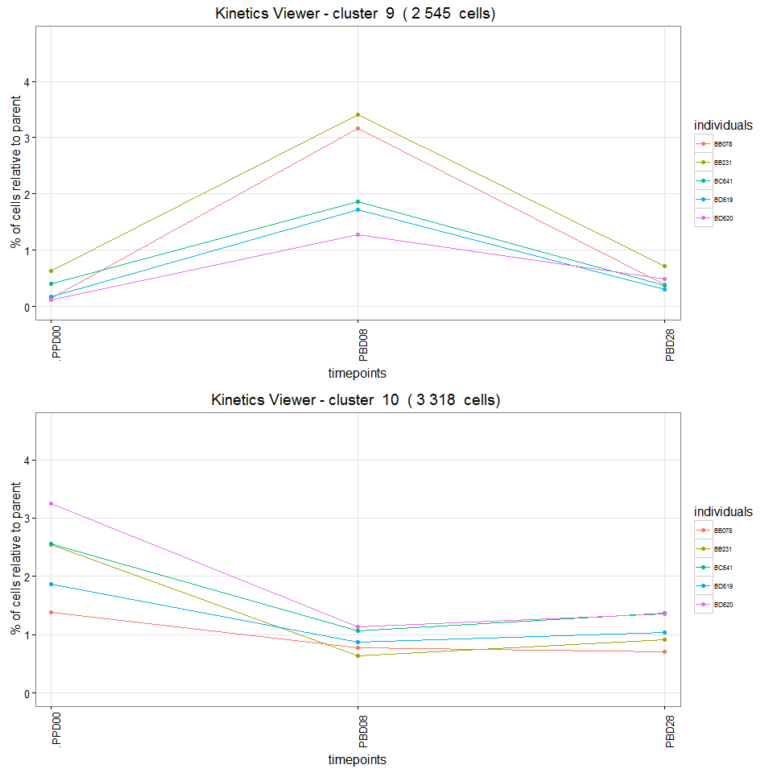
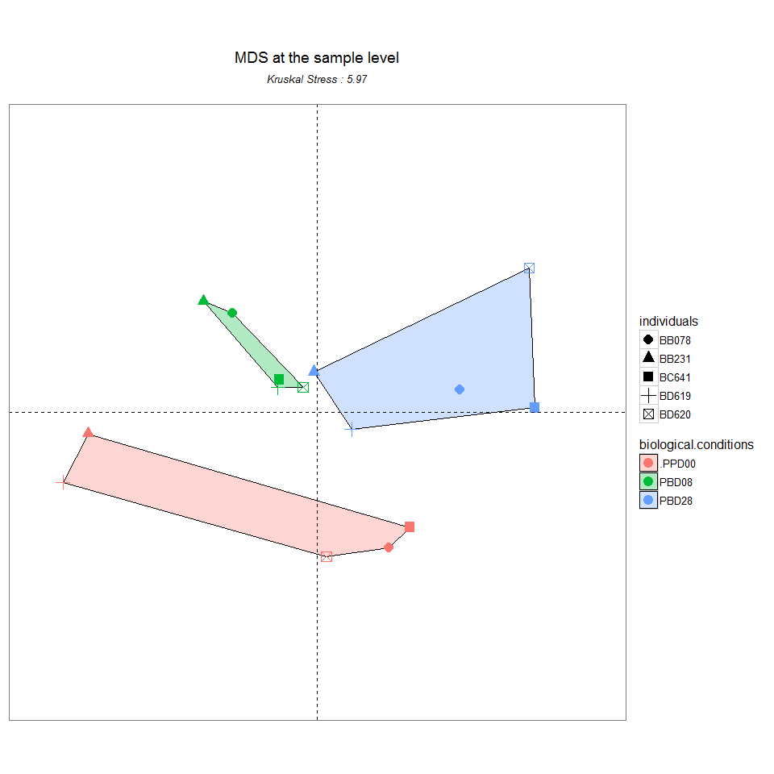
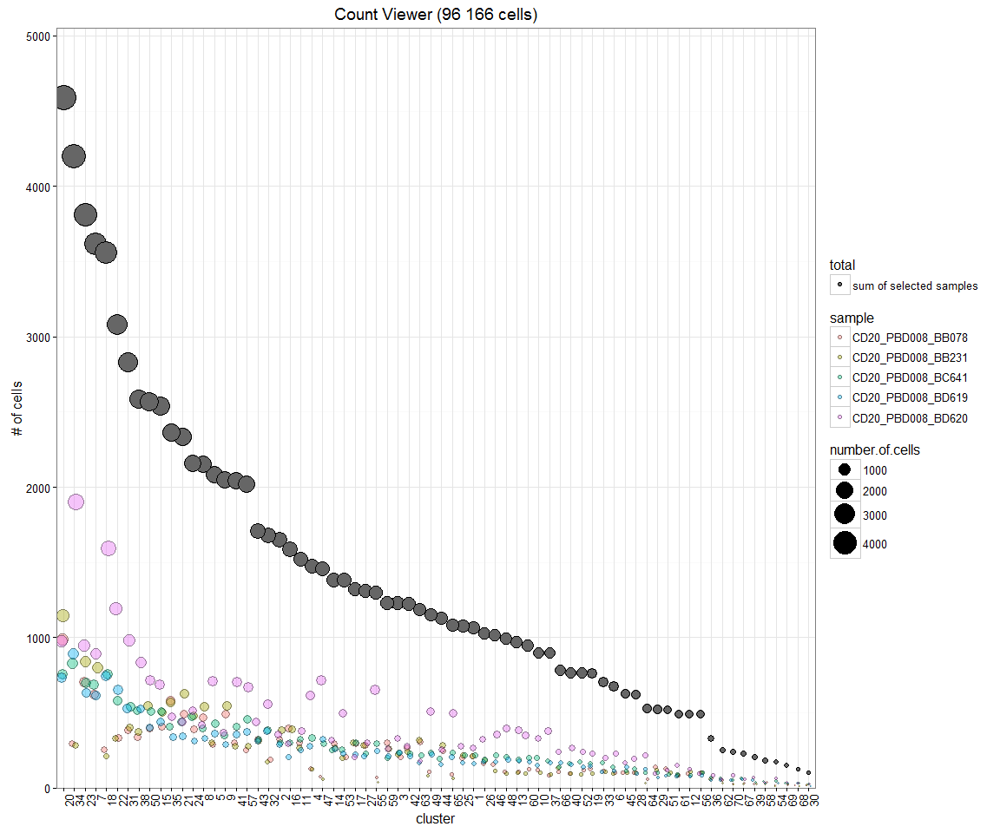

# SPADEVizR: an R package for the visualization and analysis of SPADE clustering results
Guillaume Gautreau, David Pejoski, Ludovic Platon, Roger Le Grand, Antonio Cosma, Anne-Sophie Beignon and Nicolas Tchitchek  


# Table of Contents
1. [Package overview](#package_overview)
2. [Package installation](#package_installation)
3. [Importing automatic gating results](#loading_data)
	1. [Importing automatic gating results from SPADE](#loading_SPADE_data)
	2. [Importing automatic gating results from other algorithms](#loading_other_data)
4. [Object structures](#object_structures)
	1. [Results object](#object_structure_results)
	2. [SPADEResults object](#object_structure_SPADE_results)
	3. [Abundant clusters (AC object)](#object_structure_AC)
	4. [Differentially enriched clusters (DEC object)](#object_structure_DEC)
	5. [Correlated clusters (CC object)](#object_structure_CC)
	6. [Classification of clusters based on their phenotype profiles (PhenoProfiles object)](#object_structure_PhenoProfiles)
	7. [Classification of clusters based on their enrichment profiles (EnrichmentProfiles object)](#object_structure_EnrichmentProfiles)
5. [Statistical analyses](#stat_functions)
	1. [Computation of abundant clusters](#stat_function_identifyAC)
	2. [Computation of differentially enriched clusters](#stat_function_identifyDEC)
	3. [Computation of correlated Clusters](#stat_function_identifyCC)
	4. [Classification of phenotype profiles](#stat_function_classifyPhenoProfiles)
	5. [Classification of enrichment profiles](#stat_function_classifyEnrichmentProfiles)
6. [Visualization of statistical results](#viewer_functions)
	1. [Abundant Clusters Viewer](#abundant_clusters_viewer_function)
	2. [Volcano Viewer](#volcano_viewer_function)
	3. [Correlated Clusters Viewer](#correlated_clusters_viewer_function)
	4. [Profile Viewer](#profile_viewer_function)
7. [Miscellaneous visualizations](#viewer_functions)
	1. [Cluster Viewer](#cluster_viewer_function)
	2. [Pheno Viewer](#pheno_viewer_function)
	3. [Tree Viewer](#tree_viewer_function)
	3. [MDS Viewer (Multidimensional Scaling)](#MDS_viewer_function)
	4. [Distogram Viewer](#distogram_viewer_function)
	5. [Streamgraph Viewer](#streamgraph_viewer_function)
	6. [Boxplot Viewer](#boxplot_viewer_function)
8. [Generate report](#generate_report_function)
9. [Export](#generate_report_function)
10. [License](#license)
11. [References](#references)

# <a name="package_overview"/> 1. Package overview

Flow and mass cytometry are experimental techniques used for the characterization of cell phenotypes. With the increase of usable cell markers (up to 40 markers), the identification of cell populations through manual gating is impossible. These high-dimensional data require new computational algorithms to automatically identify cell clusters. The SPADE algorithm has been proposed as a new way to analysis and explore mass-cytometry data. This algorithm performs a density-based down-sampling combined with an agglomerative hierarchical clustering.

The SPADE~\cite{spade} algorithm, which stands for Spanning Tree Progression of Density Normalized Events, was developed to identify clusters of cells having similar phenotypes in mass cytometry data.
SPADE is an hierarchical clustering-based algorithm combined to a density-based down-sampling procedure. 
In summary, SPADE is working as the following: 
(i) firstly, all cytometry profiles are down-sampled and merged into a single matrix;
(ii) a hierarchical agglomerative clustering is performed to identify cluster of cell having similar profiles for selected cell markers;
(iii) a tree structure is computed where each node represent a cluster linked using a minimal spanning tree procedure;
and (iv) all cells of the dataset are associated to their closest cell cluster (up-sampling). 
SPADE results can be summary by two main matrices.
The cluster phenotype matrix contains the marker median expression for each cluster.
The count matrix contains the number of cell associated for each sample to each cluster.

SPADE offers new opportunities to deal with high dimensional cytometry data in order to identify cell populations but does not provide strong visualization features and statistical approaches. SPADEVizR aims to improve the biological analysis of SPADE results with new visualization approaches. We extended the original SPADE visualization outputs with visualization techniques such as parallel coordinates, multidimensional scaling, volcano plots or streamgraph representations as ggplot2[6]. In addition, SPADEVizR can perform analyses to automatically identify cell populations (clusters) with 3 kinds of relevant biological behaviors. Firstly, this package allows to identify clusters with an abondance statistically greater than a specific threshold for a given condition. Secondly, it allows to identify clusters differentially enriched between two biological condition. Finnaly it is possible to find clusters correlated with an external biological variable.

# <a name="package_installation"/> 2. Package installation
The `data.table`, `ggdendro`, `ggnetwork`, `ggplot2`, `ggrepel`, `grid`, `gridExtra`, `gtools`, `igraph`, `MASS`, `reshape2`,  R packages as well as the `flowCore` [7] Bioconductor packages are required for running SPADEVizR. These packages can be installed using the following commands:

```r
install.packages('data.table')
install.packages('ggnetwork')
install.packages('ggplot2')
install.packages('ggrepel')
install.packages('ggtools')
install.packages('ggdendro')
install.packages('grid')
install.packages('gridExtra')
install.packages('igraph')
install.packages('MASS')
install.packages('scales')
install.packages('reshape2')
#install.packages('ggtimeseries')

source("http://bioconductor.org/biocLite.R")
biocLite(suppressUpdates=TRUE)
biocLite("flowCore",suppressUpdates=TRUE)
```

SPADEVizR is available on [GitHub](https://github.com), at https://github.com/tchitchek-lab/SPADEVizR. Its installation can be done via the `devtools` package using the following commands:

```r
install.packages('devtools')
library("devtools")
install_github('tchitchek-lab/SPADEVizR')
```

Once installed, SPADEVizR can be loaded using the following command:

```r
library("SPADEVizR")
```


# <a name="loading_data"/> XX Importing automatic gating results

## <a name="loading_SPADE_data"/> XX Importing automatic gating results from SPADE

The `importSPADEResults()` function allows you to import cell clustering results generated by the SPADE algorythm. The function returns a `Results` object. Such import can be done using the following command:


*Optional:* The markers of SPADE results can be renamed using a dataframe (called dictionary). Such kind of dataframe must have in the first column the original marker names and have in the second column the new marker names. For instance, a dictionary can be loaded using the following command: 


```r
dict <- read.table("C:/Users/gg248485/Downloads/headerMAC.txt",sep="\t",header = TRUE)
head(dict, n = 4)
```

```
##         metal      marker
## 1        Time        time
## 2 Cell_length cell_length
## 3   (Rh103)Di empty-Rh103
## 4   (Xe131)Di empty-Xe131
```

Once a dictionary has been defined, SPADE cell clustering results can be loaded in the same way as above and by using the `dictionary` parameter. Specific markers can be excluded from the import procedure by providing their names to the `exclude.markers` parameter. The `quantile.approximation` parameter (set by default to `TRUE`) can be used to approximate the computation of maker range quantiles. For instance, an import of a SPADE using a dictionary and by excluding the "empty-Rh103", "empty-Rh103", "empty-Rh103" and "empty-Rh103" markers can be done using the following command:

```r
results  <- importSPADEResults("C:/Users/gg248485/Desktop/SPADEVizR.data/ImMemoryB-#00008_[MARKERSET10]_K070_P025",
							   dict                   = dict,
							   quantile.approximation = TRUE,
							   exclude.markers        = c("empty-Rh103", "empty-Rh103", "empty-Rh103", "empty-Rh103"))
## [START] - extracting SPADE results
## ImMemoryB-#00008_[MARKERSET10]_K070_P025
## FCS files loading:
## 	archsin transform...
## 	compute quantiles...
## 	reading SPADE results...
## [END] - extracting SPADE results
```

## <a name="loading_other_data"/> XX Importing automatic gating results from other algorithms
Moreover, SPADEVizR functionnalities can be used from results obtained from any cell clustering algorithms, using the `importX()` function. This function return a `Results` object. The function takes 2 dataframes in parameters: `cells.count` and `marker.expressions`.

## <a name="loading_other_data"/> 3.2 Importing automatic gating results from other algorithms
Moreover, SPADEVizR functionalities can be used from results obtained from any cell clustering algorithms, using the `importX()` function. This function return a `Results` object. The function takes 2 dataframes in parameters: `cells.count` and `marker.expressions`.

 * `cells.count` is a dataframe containing the number of cells for each cluster of each sample. **This dataframe must be formated with cluster names in rownames** as bellow: 

| sample1 | sample2| ...
|---------|--------|----
| 749     | 5421   | ...
| 450     | 412    | ...
| ...     | ...    | ...

 * `marker.expressions` is a dataframe containing the marker median expressions for each cluster of each sample. This dataframe must be formated as bellow:

sample   | cluster  | marker1  | marker2| ...
---------|----------|----------|--------|-----
sample1  | cluster1 | 0.2      | 0.3    | ...
sample1  | cluster2 | 0.1      | 0.3    | ...
sample2  | cluster1 | 0.5      | 2.3    | ...
sample2  | cluster2 | 1        | 1.3    | ...
...      | ...      | ...      | ...    | ...

For instance, an import of cell clustering results obtained from as previously described can be done using the follwing command:

```r
#marker.expressions <- read.delim("PATH")
#cells.count        <- read.delim("PATH")
#results_other      <- importX(cells.count =  cells.count, marker.expressions = marker.expressions)
```

`Results` objects can be used by all functions excepting the `TreeViewer()`, `PhenoViewer()` (Heatmap viewer) and `classifyPhenoProfiles()` which only accept a `SPADEResult` object.

# <a name="stat_functions"/> XX Statistical analysis

## <a name="stat_function_identifyAC"/> 5.1 Computation of abundant clusters
The `identifyAC()` function identify clusters with a number of associated cells statistically different from zero in a biological condition. 

The `identifyAC()` function takes as parameter a `SPADEResult` object and a named logical vector `condition` specifying the samples to use in the statistical computation. This named vector must provide the correspondence between samples (in names) and logical values (`TRUE` or `FALSE`). Significant abundant clusters are characterized by two thresholds: the p-value threshold (`th.pvalue` parameter, set by default to `0.05`) and the mean abundance threshold (`th.mean` parameter, set by default to `0`).

The`identifyAC()` function returns a plotable `AC` object (see [Abundant Clusters Viewer](#abundant_clusters_viewer_function)).

```r
condition <- c(TRUE,TRUE,TRUE,TRUE,TRUE,TRUE,TRUE,FALSE,FALSE,TRUE,TRUE,TRUE,FALSE,FALSE,TRUE)
names(condition) <- results@sample.names
resultsAC <- identifyAC(results, condition = condition, th.pvalue = 0.01, th.mean = 1)
## [START] - computing ACs
## Sampled used :
## CD20_PBD008_BB078
## CD20_PBD008_BB231
## CD20_PBD008_BC641
## CD20_PBD008_BD619
## CD20_PBD008_BD620
## CD20_PBD028_BB078
## CD20_PBD028_BB231
## CD20_PBD028_BD620
## CD20_PPD000_BB078
## CD20_PPD000_BB231
## CD20_PPD000_BD620
## [END] - computing ACs
print(resultsAC)
## Object class: Abundant Clusters (AC)
## Samples: CD20_PBD008_BB078; CD20_PBD008_BB231; CD20_PBD008_BC641; CD20_PBD008_BD619; CD20_PBD008_BD620; CD20_PBD028_BB078; CD20_PBD028_BB231; CD20_PBD028_BD620; CD20_PPD000_BB078; CD20_PPD000_BB231; CD20_PPD000_BD620
## Use matrix of percent: TRUE
## Statistical test used is: t.test
## Adjusted: none
## P-value threshold:  0.01
## Mean threshold:  1
```
## <a name="stat_function_identifyDEC"/> XX Computation of differentially enriched clusters
The `identifyDEC()` function identify clusters with a number of associated cells statistically different between two biological conditions. 

The `identifyDEC()` function takes as parameter, a `SPADEResult` object and a named numeric vector `conditions` specifying the samples to consider in the two conditions. This named vector must provide the correspondence between samples (in names) and conditions (`1` to specify the first biological condition, `2` to indicate the second biological condition and `NA` otherwise). Differentially enriched clusters are characterized by two thresholds: the p-value threshold (`th.pvalue` parameter, set by default to `0.05`) and the fold-change threshold (`th.fc` parameter, set by default to `1`).

The `identifyDEC()` function returns a plotable `DEC` object (see [Volcano Viewer()](#volcano_viewer_function)).

```r
conditions <- c(1,1,NA,NA,1,1,1,2,2,NA,NA,2,2,2,2)
names(conditions) <- results@sample.names
resultsDEC <- identifyDEC(results,conditions = conditions, th.pvalue = 0.1, th.fc = 2)
## [START] - computing DECs
## cond1:
## CD20_PBD008_BB078
## CD20_PBD008_BB231
## CD20_PBD008_BD620
## CD20_PBD028_BB078
## CD20_PBD028_BB231
## cond2:
## CD20_PBD028_BC641
## CD20_PBD028_BD619
## CD20_PPD000_BB231
## CD20_PPD000_BC641
## CD20_PPD000_BD619
## CD20_PPD000_BD620
## [END] - computing DECs
print(resultsDEC)
## Object class: Differentially Enriched Clusters (DEC)
## Sample of Condition 1: CD20_PBD008_BB078; CD20_PBD008_BB231; CD20_PBD008_BD620; CD20_PBD028_BB078; CD20_PBD028_BB231
## Sample of Condition 2: CD20_PBD028_BC641; CD20_PBD028_BD619; CD20_PPD000_BB231; CD20_PPD000_BC641; CD20_PPD000_BD619; CD20_PPD000_BD620
## Use matrix of percent: TRUE
## Statistical test used is: t.test
## Adjusted: none
## Paired: FALSE
## P-value threshold:  0.1
## Fold-change threshold:  2
```
## <a name="stat_function_identifyCC"/> XX Computation of correlated clusters
The `identifyCC()` function identify clusters correlated with an external biological variable. 

The `identifyCC()` function takes as parameter, a `SPADEResult` object and a named numeric vector `variable` specifying the expression values of the external biological variable. This named vector must provide the correspondence between samples (in names) and the expression values (`NA` to exclude this sample from analysis). Significant correlated clusters are caracterized by two thresholds: the p-value threshold (`th.pvalue` parameter, set by default to `0.05`) and the correlation (R) threshold (`th.correlation` parameter, set by default to `0.7`).

The `identifyCC()` function returns a plotable `CC` object (see [Correlated Clusters Viewer](#correlated_clusters_viewer_function))

```r
variable <- c(8,1.7,4,23,10,8,1.7,4,23,10,8,1.7,4,23,10)
names(variable) <- results@sample.names
resultsCC <- identifyCC(results, variable = variable, th.pvalue = 0.001, th.correlation = 0.8)
## [START] - computing CCs
## [END] - computing CCs
print(resultsCC)
## Object class: Correlated Clusters (CC)
## Samples: CD20_PBD008_BB078; CD20_PBD008_BB231; CD20_PBD008_BC641; CD20_PBD008_BD619; CD20_PBD008_BD620; CD20_PBD028_BB078; CD20_PBD028_BB231; CD20_PBD028_BC641; CD20_PBD028_BD619; CD20_PBD028_BD620; CD20_PPD000_BB078; CD20_PPD000_BB231; CD20_PPD000_BC641; CD20_PPD000_BD619; CD20_PPD000_BD620
## Phenotypic variables: 8; 1.7; 4; 23; 10; 8; 1.7; 4; 23; 10; 8; 1.7; 4; 23; 10
## Use matrix of percent: TRUE
## Statistical test used is: pearson
## Adjusted : none
## P-value threshold: 
##  0.001
## Correlation threshold: 
##  0.8
```
## <a name="stat_function_classifyPhenoProfiles"/> XX Classification of clusters based on their phenotype profiles
The `classifyPhenoProfiles()` function classifies each cluster in different classes based on their marker expressions. Differents clustering methods are available among hierarchical clustering, k-means, eigen vector decomposition, clique clustering. This function can only handle `SPADEResults` objects (but not a `Results` object). 

The `classifyPhenoProfiles()` function takes a `SPADEResults` object and a `method` parameter among:

 * "hierarchical_k" (by default): performs a hierarchical clustering by specifying the desired number of classes. The number of desired classes needs to be specify using the `class.number` parameter.
 * "hierarchical_h" performs a hierarchical clustering by specifying the cut height. The height where the hierarchical tree should be cut needs to be specify using the `hierarchical.correlation.th` parameter.
 * "k-means": performs a k-means clustering. The number of desired classes needs to specify using the `class.number` parameter.
 * "eigencell": performs a eigen vector decomposition. The correlation coefficient cutoff needs to be specify using the `eigencell.correlation.th` parameter.
 * "clique": performs a clique clustering. The correlation coefficient cutoff needs to be specify using the `clique.correlation.th` parameter.

For instance, a classification of cell clusters based on their phenotypes can be performed using the following command: 

```r
#PhenoProfiles <- classifyPhenoProfiles(results, method.name = "k-means", class.number = 10)
#print(PhenoProfiles)
```
The `classifyPhenoProfiles()` function returns a `PhenoProfiles` object containing mainly the cluster associations.
## <a name="stat_function_classifyEnrichmentProfiles"/> XX Classification of clusters based on enrichment profiles
The `classifyEnrichmentProfiles` function classifies each cluster in different classes based on their the number of cells associated with each sample (enrichment profiles). Differents clustering methods are available among hierarchical clustering, k-means, eigen vector decomposition, clique clustering.

The `classifyEnrichmentProfiles` function takes a `Results` or `SPADEResult` object and a `method` parameter among:

 * "hierarchical_k" (by default): performs a hierarchical clustering by specifying the desired number of classes. The number of desired classes needs to be specify using the `class.number` parameter.
 * "hierarchical_h" performs a hierarchical clustering by specifying the cut height. The height where the hierarchical tree should be cut needs to be specify using the `hierarchical.correlation.th` parameter.
 * "k-means": performs a k-means clustering. The number of desired classes needs to be specify using the `class.number` parameter.
 * "eigencell": performs a eigen vector decomposition. The correlation coefficient cutoff needs to be specify using the `eigencell.correlation.th` parameter.
 * "clique": performs a clique clustering. The correlation coefficient cutoff needs to be specify using the `clique.correlation.th` parameter.

For instance, a classification of cell clusters based on their enrichment profiles can be performed using the following command: 

```r
#EnrichmentProfiles <- classifyEnrichmentProfiles(results, method.name = "k-means", class.number = 10)
#print(EnrichmentProfiles)
```
The `classifyEnrichmentProfiles` function returns a `EnrichmentProfiles` object containing mainly the cluster associations.

# <a name="viewer_functions"/> XX Vizualisation of statistical results

## <a name="abundant_clusters_viewer_function"/> XX Abundant Clusters Viewer

The `abundantClustersViewer` function is used to visualize identified abundant clusters, that is to say results contained in an [AC objet](#object_structure_AC). This representation displays the p-value (shown as -log10(p-value) in X-axis) and the mean (Y-axis) of cells abundance in a two dimensional visualization. Each dot represents a cluster and abundant clusters are shown in red. The size of dots is proportional to the number of associated cells (--all samples are considered--).

For instance, results contained in an `AC` object can be shown using the following command:

```r
plot(resultsAC)
```


## <a name="volcano_viewer_function"/> XX Volcano Viewer

The `volcanoViewer` function is used to visualize identifed differentially enriched clusters, that is to say results contained in a [DEC objet](#object_structure_DEC). The volcano plot [9] representation displays the p-value (shown as -log10(p-value) in Y-axis) and the fold-change (in X-axis) of abundance cells in a two dimensional visualization. By default, the fold-change is represented with a log2 transformation (which can be change using the `fc.log2` parameter). Each dot represents a cluster and differentially enriched clusters are shown in red. The size of dots is proportional to the number of associated cells (--all samples are considered--).

For instance, results contained in an `DEC` object can be shown using the following command:

```r
plot(resultsDEC, fc.log2 = FALSE)
```


## <a name="correlated_clusters_viewer_function"/> XX Correlated Clusters Viewer

The `correlatedClustersViewer` function is used to visualize identifed correlated clusters, that is to say results contained in a [CC objet](#object_structure_CC). This representation show the p-value (shown as -log10(p-value) in Y-axis) and the correlation coefficient (shown in X-axis) of correlated clusters in a two dimensional visualization. Each dot represents a cluster and correlated clusters are shown in red. The size of dots is proportional to the number of associated cells (--all samples are considered--).

For instance, results contained in an `CC` object can be shown using the following command:

```r
plot(resultsCC)
```


## <a name="profile_viewer_function"/> XX Profile Viewer

The `Profile Viewer` function is used to visualize classification results. This function can be used either on `EnrichmentProfiles` object or `PhenoProfiles` object and show classes of as a graph. In this graph, nodes represent clusters and edges connect clusters sharing the same class. The size of nodes is proportional to the number of associated cells.

-- how to display clique cluster of eigen cell clustering ? --

For instance, a `EnrichmentProfiles` object or `PhenoProfiles` object can be shown using the following command:

```r
#plot(EnrichmentProfiles)
```

# <a name="#viewer_functions"/> XX Miscellaneous vizualisations

## <a name="tree_viewer_function"/> XX Tree Viewer

The `treeViewer` function improve the SPADE tree showing the number of cells for each cluster (node of the tree) and if DEC, AC or CC object is provided (with parameter: `stat.object`), it highlights significant clusters. This function can only handle `SPADEResults` objects (but not a `Results` object). 


```r
treeViewer(results, stat.object = resultsDEC)
```


## <a name="pheno_viewer_function"/> XX Pheno Viewer

The `phenoViewer` function returns an heatmap of expression scores for each marker of each cluster.
For each marker, median expressions are discretized in severals categories corresponding to the heat intensities.
This function can only handle `SPADEResults` objects (but not a `Results` object). 


```r
phenoViewer(results)
## [START] - computing PhenoTable
## [END] - computing PhenoTable
```


## <a name="boxplot_viewer_function"/> XX Boxplot Viewer

The `boxplotViewer` function aims to compare cell enrichment of a cluster across several biological conditions. Biological `conditions` are encoded in a named vector with samples in rownames providing correspondence with a biological condition (numeric or character are allowed). 


```r
conditions <- c("0 jours","0 jours","0 jours","0 jours",NA,"8 jours","8 jours","8 jours","8 jours",NA,"28 jours","28 jours","28 jours","28 jours",NA)
names(conditions) <- results@sample.names
gridExtra::grid.arrange(grobs = boxplotViewer(results, show.legend = TRUE, conditions = conditions, clusters=c("1","3")))
## These clusters will be compute:
## 1	3
```


## <a name="kinetic_viewer_function"/> XX Kinetic Viewer

The `kineticsViewer` function aims to represent the evolution of cells abundance for each cluster across the time for one or several individuals. It needs the `SPADEResult` object and to specify the `assignments` parameter. This parameter needs a dataframe with sample names in row names and 2 others column providing the timepoints and individuals associated with samples. 


```r
assignments <- data.frame(row.names = results@sample.names,
						  timepoints = c(0,0,0,0,0,8,8,8,8,8,28,28,28,28,28), 
						  individuals = c("BB078","BB231","BC641","BD619","BD620","BB078","BB231","BC641","BD619","BD620","BB078","BB231","BC641","BD619","BD620"))

gridExtra::grid.arrange(grobs = kineticsViewer(results, assignments = assignments, clusters=c("1","3")))
## These clusters will be compute :
## 1	3
```


## <a name="cluster_viewer_function"/> XX Cluster Viewer

The `clusterViewer` function returns a parallel coordinates respresentation for each cluster of each marker (clustering markers are shown in bold). This visualization allows to compare marker expressions between clusters and also with mean and quantiles expressions. 

The `show.mean` parameter specify the kind of information to display in the cluster viewer. The available values for this parameter are : 

 * "only" value will show only the mean of median maker expressions for all selected samples (displayed as black dashed line)
 * "none" value will show marker median expressions for each selected samples.
 * "both" value will show marker median expressions for each selected samples together with the mean of median maker expressions for all selected samples 
 
In order to restrain visualization to specific markers and cluster, it is possible to provide a vector of marker names to `markers` parameter or in the same way a vector of clusters to `clusters` parameter.
For instance, the following command describe how to visualize cluster 1 and 8 :

```r
gridExtra::grid.arrange(grobs = clusterViewer(results,clusters = c("1","8"),show.mean = "both"))
```


## <a name="distogram_viewer_function"/> XX Distogram Viewer

The `distogramViewer` function displays markers co-expression based on the pearson correlation.


```r
distogramViewer(results)
```


## <a name="streamgraph_viewer_function"/> XX Streamgraph Viewer

The `streamgraphViewer` function aims to represent the evolution of cells abundance of all clusters selected using `clusters` parameter. To select and order sample, you should provide to `order` parameter, a named vector with samples in rownames providing correspondence with a position (integer) or NA to exclude a sample. 


```r
order <- c(1,3,NA,2,4,5,6,NA,9,NA,15,14,12,11,13)
names(order) <- results@sample.names
streamgraphViewer(results,order = order, clusters = c("1","2","3","14","5"))
## These clusters will be compute :
## 1	2	3	14	5
```


## <a name="MDS_viewer_function"/> XX MDS Viewer (Multidimensional Scaling)

MDS methods aim to represent the similarities and differences among high dimensionality objects into a space of a lower dimensions, generally in two or three dimensions for visualization purposes [8]. In MDS representations, the Kruskal Stress (KS) indicates the amount of information lost during the dimensionality reduction process.

The `MDSViewer` function generates a MDS (Multidimensional Scaling) representation either of clusters or samples depending of `space` parameter. If `space = "sample"`, `assignments` is required (as for [Kinetic Viewer](kinetic_viewer_function)).


```r
MDSViewer(results, space = "clusters", assignments = assignments,clusters = c("2","3","4","5","6","7","9"))
## These clusters will be compute :
## 2	3	4	5	6	7	9
## MDS computation
## done
```


```r
MDSViewer(results, space = "samples", assignments = assignments, clusters = c("2","3","4","5","6","7","9"))
## These clusters will be compute :
## 2	3	4	5	6	7	9
## MDS computation
## done
```


## <a name="count_viewer_function"/> XX Count Viewer

The `CountViewer` function aims to visualize the number of cells in each cluster. This representation displays the clusters (in X-axis) and the number of cells (Y-axis) in a two dimensional visualization. The function computes the sum of all samples by default but allows to select the samples (using `samples` parameter) which are used to calculate the number of cells in each cluster. By default, all clusters will be displayed but a vector of cluster can be provided to select desired cluster (using `clusters` parameter).

For instance, the following command describe how to select samples and clusters and then visualize the number of cells in each cluster :

```r
samples <- c(TRUE,TRUE,TRUE,TRUE,TRUE,TRUE,TRUE,FALSE,FALSE,TRUE,TRUE,TRUE,FALSE,FALSE,TRUE)
names(samples) <- results@sample.names
countViewer(results,samples = samples, clusters = c("1","8","7","4","5","6","3","19","45","22"))
```


## <a name="biplot_viewer_function"/> XX Biplot Viewer

The `biplot` function can be use to visualize a two dimensions plot with an x-axis marker (`x.marker`) and a y axis marker (`y.marker`). It allows to filter cells by clusters and samples with `clusters` and `samples` parameters. Moreover, cells can be shown for of all samples merged or with a facet for each sample.
When too cells dots are displayed, it can require some seconds. In order to seep up the computation, it is possible to reduce the number of cells displayed (downsampling) using the `resample.ratio` parameter.  

This function can only handle `SPADEResults` objects (but not a `Results` object). 

```r
samples <- c(TRUE,TRUE,FALSE,FALSE,TRUE,TRUE,TRUE,TRUE,FALSE,TRUE,FALSE,TRUE,FALSE,FALSE,TRUE)
names(samples) <- results@sample.names
biplotViewer(results, x.marker = "CD3", y.marker = "CD8", samples = samples, clusters = c("1","8","7","4","5","6","3","19","45","22"))
```


# <a name="license"/> XX Export 
The `export()` function is available for all objects of this package. Use this function to export an object to a tab separated file able to be open with Microsoft Excel&copy; or with Libre Office Calc.


```r
export(AC,filename = "DESIRED_PATH.txt")
```

# <a name="license"/> XX Generate report 
The `generateReport()` function allows to easily generate a PDF file containing all desired plots. In order to select the plots to include in the report, you could provided a character vector containing the names of desired plots among: 

#TO MODIFY
 * "pheno" to include Pheno Viewer
 * "kinetic" to include Kinetic Viewer (need to provide the `assignment` parameter in the same way as [Kinetic Viewer](kinetic_viewer_function) function)
 * "cluster" to include Cluster Viewer
 * "kinetic_cluster" to include Kinetic Viewer juxtaposed with Cluster Viewer
 * "tree" to include Tree Viewer
 * "disto" to include Distogram Viewer
 * "stream" to include Streamgraph Viewer
 * "MDS" to include MDS Viewer (if `assignement` parameter is provide, it will plot the 2 spaces: "clusters" and "samples" of MDS representation, else only "clusters" space will be plotted)

The report will follows the order of plots names in the vector.

You can also provided a vector of stat objects (AC, DEC, CC) with the `stat.objects` parameter and a vector of profile.objects (`PhenoProfile` and `EnrichmentProfile`) with the `profile.objects` parameter


```r
generateReport(results,PDFfile = "DESIRED_PATH.pdf", assignments = assignments, report = c("pheno", "kinetic_cluster","tree", "disto","stream","MDS"))
```

*Generating a big report can take a minute or more.*

# <a name="object_structures"/> XX Object structures
The `print` and `show` functions are available for all objects of this package.

## <a name="object_structure_results"/> XX Results object 
The `Results` object is a S4 object containing the count matrix and the cluster phenotypes. It is to note that `Results` is a super classe of the `SPADEResult` (defined in next subsection).

Different slots are available for a given `Results` object:

Slot               | Description
-------------------|----------------------------------------------------------------------------------------
cells.count        | a dataframe containing the number of cells for each cluster of each sample
marker.expressions | a numerical dataframe containing marker median expressions for each cluster of each sample
sample.names       | a character vector containing the sample names
marker.names       | a character vector containing the markers names
cluster.number     | a numeric specifying the number of cell clusters

## <a name="object_structure_SPADE_results"/> XX SPADEResults object 
The `SPADEResults` object is a S4 object containing the clustering results from SPADE. It is to note that this object extend the `Results` object and contains additional slots related to SPADE data.

Different slots are available for a given `SPADEResults` object:

Slot          | Description            | Inherited
--------------|-------------------------------------------------------|--------
cells.count        | a dataframe containing the number of cells for each cluster of each sample                 | &#9745;
marker.expressions | a numerical dataframe containing marker median expressions for each cluster of each sample | &#9745;
sample.names       | a character vector containing the sample names                                             | &#9745;
marker.names       | a character vector containing the markers names                                            | &#9745;
cluster.number     | a numeric specyfing the number of clusters                                                 | &#9745;
use.raw.medians    | a logical specifying if the marker expressions correspond to the raw or transformed data   | &#9746;
marker.clustering  | a logical vector specifying markers that have been used during the clustering procedure    | &#9746;
fcs.files          | a character vector containing the absolute path of the original FCS files                  | &#9746;
quantiles          | a numeric data.frame containing the quantiles for each marker of each cluster              | &#9746;
graph              | an igraph object containing the SPADE tree                                                 | &#9746;
graph.layout       | a numeric matrix containing the layout of the SPADE tree                                   | &#9746;

## <a name="object_structure_AC"/> XX Abundant Clusters (AC object)
The `AC` object is a S4 object containing the main information related to the abundant clusters, that is to say xxx, identify by the [`identifyAC()`](#stat_function_identifyAC) function.  

Different slots are availables for a given `AC` object:

Slot       | Description
-----------|----------------------------------------------------------------------------------------
sample.names       | a character vector containing the samples used to compute the abundant clusters
cluster.size       | a numeric vector containing the number of cells ( -- sum of all samples -- ) for each cluster
use.percentages    | a logical specifying if computation was performed on percentage of cell abundance
method             | a character containing the name of the statistical test used to identify the abundant clusters
method.adjust      | a character containing the name of the multiple correction method used (if any)
th.mean            | a numeric value specifying the mean threshold
th.pvalue          | a numeric value specifying the p-value threshold
result             | a data.frame containing for each cluster (first column): the mean (second column) and the standard deviation (third column) of the biological condition, the associated p-value (fourth column) and a logical (fifth column) specifying if the cluster is significantly abundant.

## <a name="object_structure_DEC"/> XX Differentially Enriched Clusters (DEC object)
The `DEC` object is a S4 object containing the main information related to the differentially enriched clusters, that is to say xxx, identify by the [`identifyDEC()`](#stat_function_identifyDEC)  

Different slots are available for a given `DEC` object:

Slot       | Description
-----------|----------------------------------------------------------------------------------------
sample.cond1       | a character specifying the names of the samples of the first biological condition
sample.cond2       | a character specifying the names of the samples of the second biological condition
cluster.size       | a numeric vector containing number of cells ( -- sum of all samples -- ) for each cluster
use.percentages    | a logical specifying if computation was performed on percentage of cell abundance
method             | a character containing the name of the statistical test used to identify the DEC
method.adjust      | a character containing the name of the multiple correction method used (if any)
method.paired      | a logical indicating if the statistical test have been performed in a paired manner
th.fc              | a numeric value specifying the fold-change threshold
th.pvalue          | a numeric value specifying the p-value threshold
result             | a data.frame containing for each cluster (first column): the fold-change (second column) and the standard deviation (third column) for the first biological condition, the fold-change (fourth column) and the standard deviation (fifth column) for the second biological condition, the associated p-value (sixth column) and a logical (seventh column) specifying if the cluster is significantly differentially enriched.

## <a name="object_structure_CC"/> XX Correlated Clusters (CC object)
The `CC` object is a S4 object containing object containing the main information related to the correlated clusters, that is to say xxx, identify by the [`identifyCC()`](#stat_function_identifyCC)  

Different slots are available for a given `CC` object:

Slot       | Description
-----------|----------------------------------------------------------------------------------------
sample.names       | a character vector containing the samples used to compute correlated clusters
variable           | a numeric vector containing the expression values of the associated variable
cluster.size       | a numeric vector containing number of cells ( -- sum of all samples -- ) for each cluster
use.percentages    | a logical specifying if computation was performed on percentage of cell abundance
method             | a character containing the name of the statistical test used to identify the CC
method.adjust      | a character containing the name of the multiple correction method used (if any)
th.correlation     | a numeric value specifying the correlation threshold (R)
th.pvalue          | a numeric value specifying the p-value threshold
result             | a data.frame containing for each cluster (first column): the coefficiant of correlation R (second column) , the associated p-value (third column) and a logical (fourth column) specifying if the cluster is significantly correlated.

## <a name="object_structure_PhenoProfiles"/> XX Classification of clusters based on their phenotype profiles (PhenoProfiles object)
The `PhenoProfiles` object is a S4 object containing the main information related of the cluster classification obtained by the [`classifyPhenoProfiles()`](#stat_function_classifyPhenoProfiles) function.

Different slots are available for a given `PhenoProfiles` object:

Slot               | Description
-------------------|----------------------------------------------------------------------------------------
class.number       | a numeric value specifying the number of classes
method             | a character specifying the method used to classify cluster
method.parameter   | a named list of parameters used by the classification method
cluster.size       | a numeric vector containing the number of cells associated with each cluster (-- sum of all samples --)
(XXX) cluster.number| a numeric value specifying the number of clusters
classes            | a two column dataframe with the cluster in first colunm and corresponding classe in the second colunm

## <a name="object_structure_EnrichmentProfiles"/> XX Classification of clusters based on their enrichment profiles (EnrichmentProfiles object)
The `EnrichmentProfiles` object is a S4 object containing the main information related of the cluster classification obtained by the [`classifyEnrichmentProfiles`](#stat_function_classifyEnrichmentProfiles)  

Different slots are available for a given `PhenoProfiles` object:

Slot               | Description
-------------------|----------------------------------------------------------------------------------------
class.number       | a numeric value specifying the number of classes
method             | a character specifying the method used to classify cluster
method.parameter   | a list of parameters used by the selected method
cluster.size       | a numeric vector with the number of cell in each cluster (-- sum of all samples --)
( XXX) cluster.number | a numeric value specifying the number of clusters
classes            | a two column dataframe with the cluster in first colunm and corresponding classe in the second colunm 


# <a name="license"/> 11. License
SPADEVizR is freely distributed under the GLP-3 license.

# <a name="references"/> 12. References 
[1] - Bendall, S. C., Simonds, E. F., Qiu, P., Amir, E. D., Krutzik, P. O., Finck, R., . Nolan, G. P. (2011). Single-cell mass cytometry of differential immune and drug responses across a human hematopoietic continuum. Science (New York, N.Y.), 332(6030), 687-96.

[2] - Gregori, G., Rajwa, B., Patsekin, V., Jones, J., Furuki, M., Yamamoto, M., & Paul Robinson, J. (2014). Hyperspectral cytometry. Current Topics in Microbiology and Immunology, 377, 191-210.

[3] - http://www.flowjo.com/

[4] - https://www.cytobank.org

[5] - Qiu, P., Simonds, E. F., Bendall, S. C., Gibbs, K. D., Bruggner, R. V, Linderman, M. D., . Plevritis, S. K. (2011). Extracting a cellular hierarchy from high-dimensional cytometry data with SPADE. Nature Biotechnology, 29(10), 886-91.

[6] - Grammar of Graphics library http://ggplot2.org/

[7] - Ellis B, Haaland P, Hahne F, Meur NL, Gopalakrishnan N, Spidlen J and Jiang M. flowCore: flowCore: Basic structures for flow cytometry data. R package version 1.34.7.

[8] - Kruskal, J. B., and Wish, M. (1978), Multidimensional Scaling, Sage University Paper series on Quantitative Application in the Social Sciences, 07-011. Beverly Hills and London: Sage Publications.

[9] - Cui X1, Churchill GA. (2003). Statistical tests for differential expression in cDNA microarray experiments. Genome Biol.
